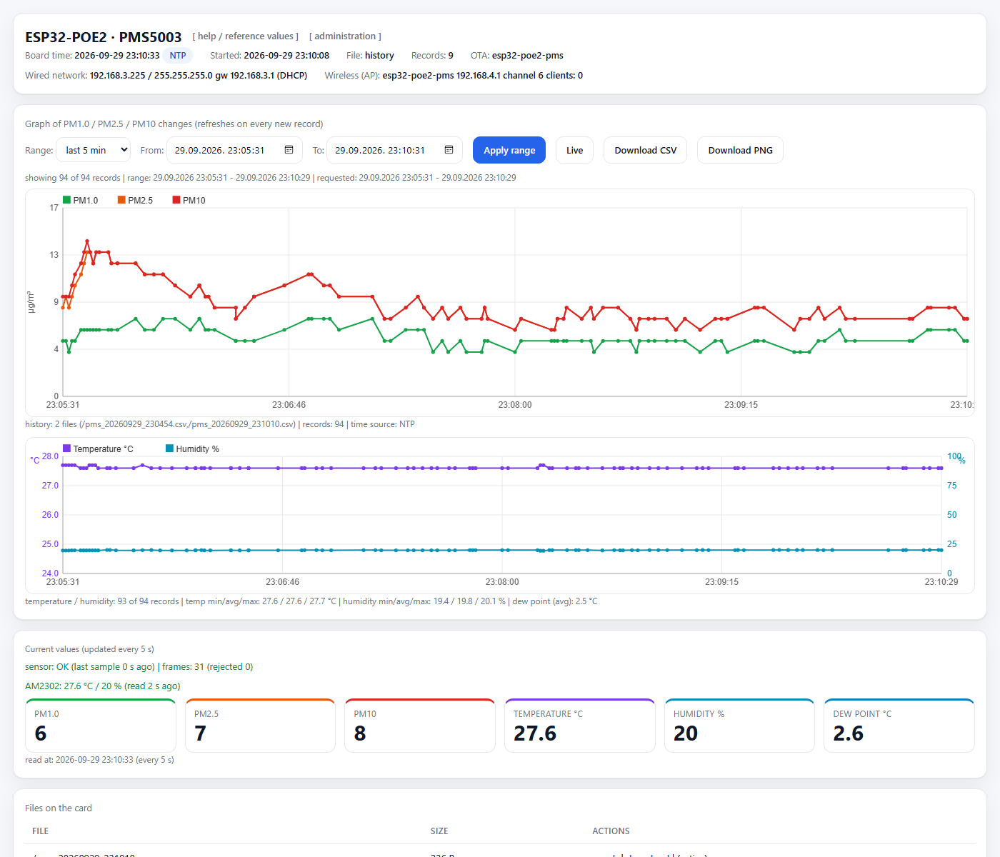

# ESP32-POE2 — PMS5003 + AM2302 environment logger with web UI and administration

Particulate matter (PM1.0 / PM2.5 / PM10) with a **PMS5003** sensor and
temperature and humidity with an **AM2302 (DHT22)** sensor on an **Olimex
ESP32-POE2**: logging to the onboard microSD card, NTP time, a web page with
charts, a Wi-Fi access point and device administration.



*Web interface: network status and boot time in the header, chart with range
filters (last 5 min by default, plus a custom from-to range), a live view of the
active file, CSV download of the selected range, current values with the sensor
freshness indicator, and the file list with download/delete actions.*

> **First login:** the administration page `/admin` and every action that
> changes the device (settings, file deletion, firmware update) is protected
> with HTTP Basic authentication. The factory credentials are user **`admin`**,
> password **`pms5003admin`** - change the password right away on `/admin`
> (section *Administration password*).

## Hardware

| Part | Details |
|---|---|
| Board | Olimex ESP32-POE2 (ESP32-WROVER-E, 4 MB flash, 8 MB PSRAM) |
| Ethernet | LAN8720: PHY addr 0, MDC=GPIO23, MDIO=GPIO18, POWER=GPIO12, CLK=GPIO0 |
| microSD | onboard slot, 1-bit SDMMC: CLK=GPIO14, CMD=GPIO15, D0=GPIO2 |
| PMS5003 | VCC=5V, GND, TX=GPIO33 (board RX), RX=GPIO13 (board TX, optional) |
| AM2302 (DHT22) | temperature + humidity, DATA=GPIO4 (EXT1 pin 19), VCC=**3.3V**, GND, 10 kOhm pull-up DATA-3.3V |
| Wi-Fi | softAP, default `esp32-poe2-pms` |

Pins not to use: GPIO16/17 (PSRAM), GPIO18/23 (Ethernet), GPIO12 (PHY power),
GPIO0 (ETH clock), GPIO14/15/2 (SD), GPIO1/3 (USB serial), GPIO34-39 (input only).

> **Power:** the POE2 has no galvanic isolation between PoE power and USB.
> Disconnect the Ethernet cable while programming over USB if the board is
> powered over PoE.

## Features

- AM2302 / DHT22 temperature and humidity are read every 3 s (bit-banged, no
  external library) and logged in the same CSV rows; they are drawn in a second
  chart and shown in the current-value tiles.
- PMS5003 is read over `Serial2` (9600 8N1), 32-byte frames with the `0x42 0x4D`
  header and a checksum; the parser re-syncs on the header and counts accepted
  and rejected frames.
- CSV logging **only when PM2.5, PM10, temperature or humidity changes**.
- One file per creation date and time: `/pms_YYYYMMDD_HHMMSS.csv`, with
  **automatic rotation at midnight** and no board restart.
- Time: **NTP** when the network is available, **MANUAL** when set from the
  administration page, otherwise **MILLIS** (always recorded in `time_source`).
- **Clock recovery after a power outage:** if the board is up before the router,
  the first records go to `/pms_millis_NNNNNNNNNN.csv` with `millis()`
  timestamps. Ethernet (link + DHCP) and NTP are retried in the background
  (every 15 s for the first ~5 minutes, then once a minute) instead of only in
  `setup()`. As soon as a real clock exists - NTP synced late, or the time set on
  `/admin` - the early rows are re-dated with `epoch = bootEpoch + millis/1000`,
  `time_source` is set to the clock that made this possible, and the file is
  renamed to its real start time (`/pms_YYYYMMDD_HHMMSS.csv`). Nothing is deleted
  before the repaired copy exists, so a failure cannot lose data.
- Ethernet (DHCP or static IP) plus a **Wi-Fi access point** (SSID, password,
  channel); web UI and OTA work on both networks.
- Web page: chart with range filters (last 5 min / 30 min / 1 h / 6 h / 24 h and
  a custom from-to range), a **Live** view of the active file (refreshes on every
  new record), a **Download CSV** button for the selected range, PNG export,
  current values, sensor freshness indicator, file list with download and delete,
  a help modal with reference PM values, and a header showing wired/wireless
  network settings and boot time.
- Quick ranges only fill the From/To fields; the chart is (re)drawn on **Apply
  range** and, in Live view, on every new record. Browsing history therefore never
  slows down logging, and a CSV download never touches the chart.
- The card is listed once and cached in RAM (`FILE_LIST_MAX`, the newest 512
  files); the cache is dropped whenever the program creates, rotates, re-dates or
  deletes a file. `/api/status` publishes that as `filesVer`, and the page reloads
  the file table only when it changes, so keeping the list open costs no SD time.
- History queries open only the files whose span overlaps the selected range,
  merge and sort them, and decimate evenly when there are more than 1200 records.
  The CSV range export is independent of that chart buffer and streams every
  matching record of those files in a single pass (a download that used to take
  about 30 s now finishes well under a second).
- CSV rows are parsed by hand instead of with `sscanf()`, which roughly halves the
  cost of reading a file.
- The SD card is monitored while logging (the serial console is disabled, so a
  dead or full card would otherwise stop the log silently). `/api/status`
  reports `sdOk`, `sdFreeMb`, `sdUsedPct`, `lastWriteAgeSec` and `writeFails`,
  and the page shows a red banner when the card is not ready, when nothing has
  been written for a minute, or when it runs out of space. The free-space
  numbers come from the card on a 30 s timer, never inside a request. While
  writes keep failing the card is remounted every 30 s, so a card that was
  pulled out and pushed back in starts working again without a restart.
- Rows are written only when something really moved: PM2.5/PM10 changes are
  written immediately, temperature and humidity only when they change by at least
  the configured step (defaults 0.2 degC / 0.5 %, editable on `/admin`) - the
  AM2302 dithers by 0.1 degC, which used to produce a row every three seconds.
  A heartbeat row is still written at least every 5 minutes while values differ.
- "One file per day" (optional, `/admin`): all restarts of a day continue in
  `/pms_YYYYMMDD_000000.csv` instead of opening a new file at every boot.
- Trade-off of "one file per day": the log is not indexed, so a range query for
  the end of the day has to read the whole (growing) day file - a few seconds for
  a multi-megabyte file. With the option off, each file holds one run and the
  queried ranges are tiny.
- File retention (optional, `/admin`): files older than N days are removed at
  boot, or on demand with **Delete older files now**. The active file is never
  touched and 0 keeps everything.
- The file table shows the span each file covers (start - end, derived from the
  file names, so opening the files is not needed).
- State-changing requests (`/delete`, `/admin` POST) are refused when the
  `Origin`/`Referer` header points at another host, which blocks cross-site
  requests that would otherwise reuse the browser's cached credentials. Requests
  without those headers (curl, scripts) keep working.
- A yellow banner appears while a documented factory password is still in use,
  and `/admin` can generate a random AP password in the browser (`Generate`).
- `/` is served with an ETag, so a browser that already has the page gets a
  small `304 Not Modified` instead of the whole ~42 KB page. Polling stops while
  the tab is hidden and refreshes as soon as it is visible again.
- The header shows why the board started (`resetReason` in `/api/status`):
  power-on, software/OTA restart, panic, task or interrupt watchdog, brownout.
  That makes an unexpected reset in the field diagnosable without a serial
  console.
- The file list shows the newest 15 files per page with page navigation.
- The environment chart uses two axes (temperature on the left with an auto
  range, humidity 0-100 % on the right) and the caption shows min/avg/max plus
  the dew point; the current dew point is also shown on a tile.
- The help modal includes reference values for temperature, humidity and dew
  point (comfort, mould risk, condensation).
- The current-value tiles refresh every 5 s from the last `/api/status` response
  instead of starting a second request, and the environment summary under the
  lower chart shows min/avg/max plus the average dew point.
- In Live view the page asks for the new records only (`/api/data?f=...&since=`),
  so a refresh transfers a few hundred bytes instead of the whole 500-record
  buffer; the board reports `oldest` and the page falls back to a full reload
  when the buffer has rotated past what it already had.
- The Live caption says how much the RAM buffer covers (records and the first to
  last timestamp); the buffer holds the newest 2000 records (about 36 KB of RAM).
- Three selectable themes: light, dark and high contrast (chart and PNG export
  follow the selected theme).
- **Administration** at `/admin`: network settings (Ethernet, AP, NTP), manual
  time setting, theme selection, administration-password change and firmware
  upload. Administration, deletion and firmware updates require HTTP Basic
  authentication. Settings are stored in NVS (`Preferences`) and survive a
  restart; changing network settings restarts the device.
- Firmware update from the browser (`/admin` → **Firmware update**) as well as
  ArduinoOTA (hostname `esp32-poe2-pms`).
- Serial output is disabled (`SERIAL_DEBUG 0`).

## CSV format

```
timestamp,time_source,pm1_0,pm2_5,pm10,temp_c,humidity
1789733325,NTP,3,7,7,22.4,48.1
```

`timestamp` is a Unix epoch (UTC) when the clock has a valid epoch (NTP or
MANUAL), otherwise `millis()`.

## Web endpoints

| Path | Purpose |
|---|---|
| `/` | HTML page with the chart |
| `/admin` | administration (GET shows the form, POST saves) |
| `/api/status` | JSON: time, networks, records, current values, theme, OTA name, NTP retry counter, re-dated record count, file-list version (`filesVer`), free heap, SD card health (`sdOk`, `sdFreeMb`, `sdUsedPct`, `lastWriteAgeSec`, `writeFails`), `resetReason` and the factory-password flags (`defaultAdminPwd`, `defaultApPwd`) |
| `/api/data?f=&since=` | JSON records of a single file (`oldest`/`newest`; `since` returns only the rows after that timestamp) |
| `/api/data?from=&to=` | JSON records across all files covering a range |
| `/api/files` | JSON list of files on the card (cached; `version`, `count`, `truncated`, `scanMs`; each file carries `from`/`to` so the table can show its span) |
| `/download?f=` | download a file |
| `/delete` | delete a file using authenticated POST form data `f` (the active one is protected) |
| `/export?from=&to=` | CSV download of the records in a range (chart untouched) |
| `/update` | firmware upload (POST, multipart) |

## Build and upload

Arduino core 3.3.11 has no board named `esp32-poe2`, so a WROVER target with
PSRAM enabled is used. Because the Wi-Fi library makes the application large
(~1.2 MB), the `min_spiffs` partition scheme (1.9 MB app partition) is required
for comfortable OTA headroom:

```sh
arduino-cli compile --fqbn esp32:esp32:esp32wrover:PartitionScheme=min_spiffs \
    arduino/pms5003_poe2_logger
arduino-cli upload  --fqbn esp32:esp32:esp32wrover:PartitionScheme=min_spiffs \
    -p COM4 arduino/pms5003_poe2_logger
```

Firmware update over the network, no USB cable needed:

```sh
# from the browser:  http://<board_IP>/admin  ->  Firmware update  ->  Upload firmware
# or with curl (uses the same endpoint):
curl -F "firmware=@pms5003_poe2_logger.ino.bin" http://<board_IP>/update
```

## Sketches in this repository

| Sketch | Purpose |
|---|---|
| `arduino/pms5003_poe2_logger` | main sketch: PMS5003 + SD + NTP + web + AP + OTA |
| `arduino/esp32_poe_test` | minimal test: blink + serial output |
| `arduino/esp32_poe_eth_test` | Ethernet test (LAN8720, DHCP) |

## EXT1 connector pinout (Olimex ESP32-POE2)

Taken from the Olimex KiCad design files (`ESP32-PoE2_Rev_B.kicad_pcb`):

| EXT1 pin | Signal | EXT1 pin | Signal |
|---|---|---|---|
| 1 | VPP | 14 | GPIO35 |
| 2 | GND | 15 | GPIO2 (SD DATA0) |
| 3 | +5VP | 16 | GPIO34 (BUT1) |
| 4 | GND | 17 | GPIO3 (U0RXD) |
| 5 | +5V | 18 | GPIO33 |
| 6 | GND | **19** | **GPIO4 (U1TXD)** |
| 7 | +3.3V | 20 | GPIO32 |
| 8 | GND | 21 | GPIO5 (SPI_CS) |
| 9 | ESP_EN | 22 | GPIO16 (I2C SCL - PSRAM on POE2, do not use) |
| 10 | GPIO39 | 23 | GPIO12 (PHY power - do not use) |
| 11 | GPIO0 | 24 | GPIO15 (SD CMD) |
| 12 | GPIO36 (U1RXD) | 25 | GPIO13 (I2C SDA) |
| 13 | GPIO1 (U0TXD) | 26 | GPIO14 (SD CLK) |

Wiring used in this project: PMS5003 on GPIO33/GPIO13 (pins 18/25), AM2302 data
on GPIO4 (pin 19), AM2302 VCC on pin 7 (3.3 V), GND on pins 2/4/6/8.

> The AM2302 must be powered from **3.3 V** (pin 7). With 5 V the data line would
> swing to 5 V, which the ESP32 is not tolerant of.

## Defaults

| Setting | Default |
|---|---|
| Ethernet | DHCP |
| Wi-Fi AP | enabled, `esp32-poe2-pms`, WPA2 `pms5003pms`, channel 6 |
| NTP server | `pool.ntp.org` |
| Time zone | `CET-1CEST,M3.5.0,M10.5.0/3` (file names and page display only) |
| Chart range | last 5 minutes |
| Theme | light |
| Administration | user `admin`, password `pms5003admin` (change it immediately on `/admin`) |
